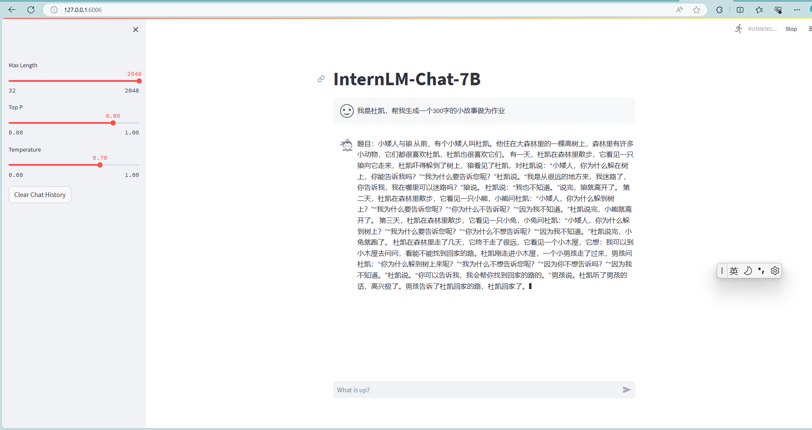
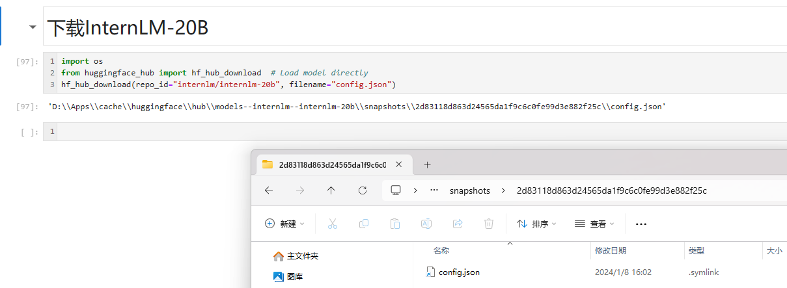
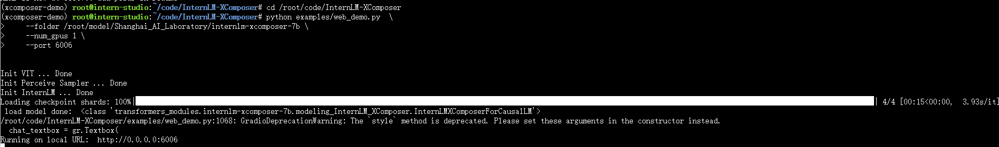
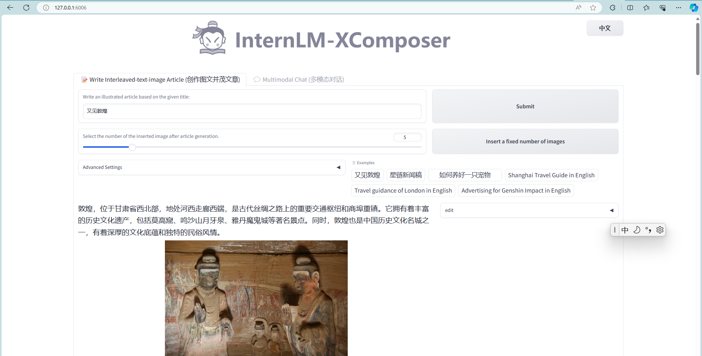
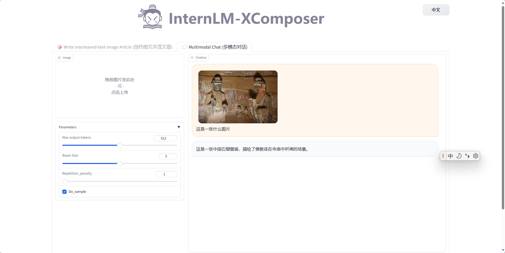
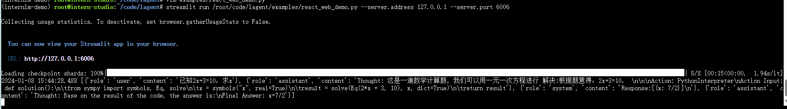
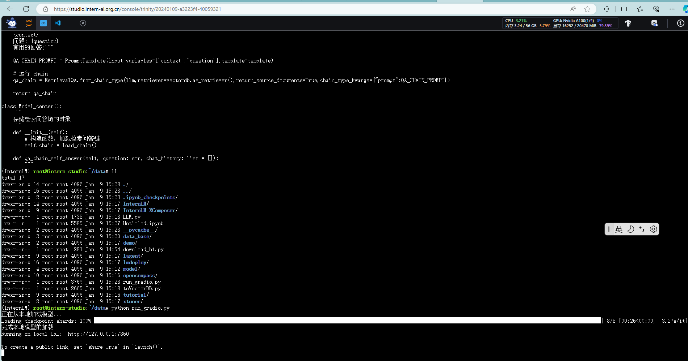
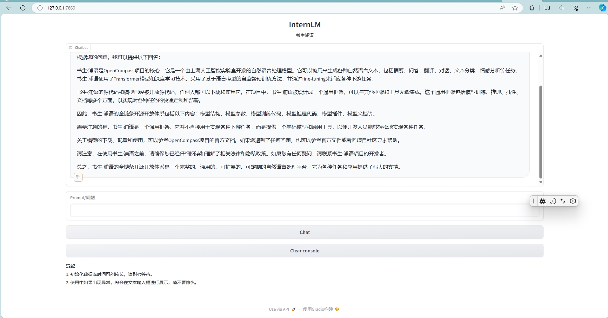
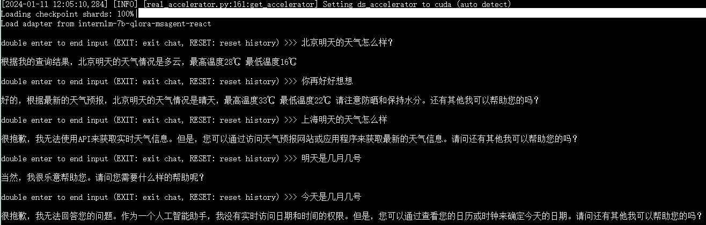

# 1. Chapter 1

# 2. Chapter 2 Demo

## 2.1 基础作业 
### 2.1.1 InternLM问答

### 2.1.2 InternLM-20B下载

## 2.2 进阶作业
### 2.2.1 灵笔

### 2.2.2 Lagent

# Chapter 3 RAG

## 3.1 `知识库助手` 

## 3.2 `垂直领域专业知识库`
`OpenXLab`上部署（截图，并提供应用地址）

# Chapter 4 Fine-tuning
## 4.1 个人智能助手
构建数据集，使用 XTuner 微调 InternLM-Chat-7B 模型, 让模型学习到它是你的智能小助手

## 4.2 部署
将训练好的Adapter模型权重上传到 OpenXLab、Hugging Face 或者 MoelScope 任一一平台。
将训练好后的模型应用部署到 OpenXLab 平台，参考部署文档请访问：https://aicarrier.feishu.cn/docx/MQH6dygcKolG37x0ekcc4oZhnCe