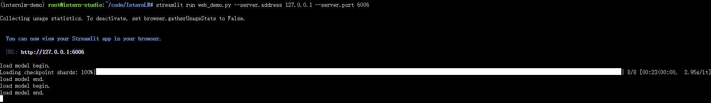

# 1. Chapter 1

# 2. Chapter 2 Demo
## 2.1 基础作业 
### 2.1.1 基础作业1 `InternLM问答`

### 2.1.2 基础作业2 `InternLM-20B下载`

## 2.2 进阶作业
### 2.2.1 进阶作业1 `灵笔`

### 2.2.2 进阶作业2 `Lagent`

# Chapter 3 RAG
## 3.1 基础作业 `知识库助手` 
## 3.2 进阶作业 `垂直领域专业知识库`
，`OpenXLab`上部署（截图，并提供应用地址）